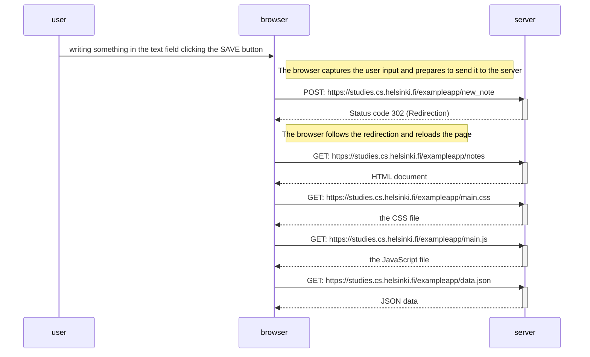

```mermaid

sequenceDiagram
    participant user
    participant browser
    participant server

    user->>browser: writing something in the text field clicking the SAVE button
    Note right of browser: The browser captures the user input and prepares to send it to the server

   browser->>server: POST: https://studies.cs.helsinki.fi/exampleapp/new_note
        activate server
        server-->>browser: Status code 302 (Redirection)
        deactivate server
    Note right of browser: The browser follows the redirection and reloads the page

    browser->>server: GET: https://studies.cs.helsinki.fi/exampleapp/notes
        activate server
        server-->>browser: HTML document
        deactivate server
 
    browser->>server: GET: https://studies.cs.helsinki.fi/exampleapp/main.css
        activate server
        server-->>browser: the CSS file
        deactivate server

    browser->>server: GET: https://studies.cs.helsinki.fi/exampleapp/main.js
        activate server
        server-->>browser: the JavaScript file
        deactivate server


    browser->>server: GET: https://studies.cs.helsinki.fi/exampleapp/data.json
        activate server
        server-->>browser: JSON data
        deactivate server


    

```